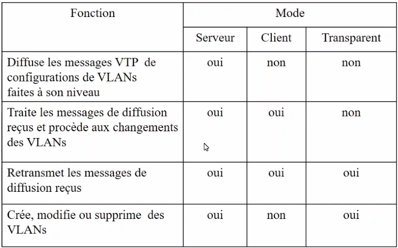
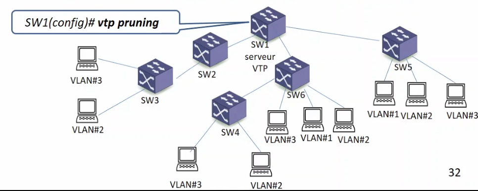
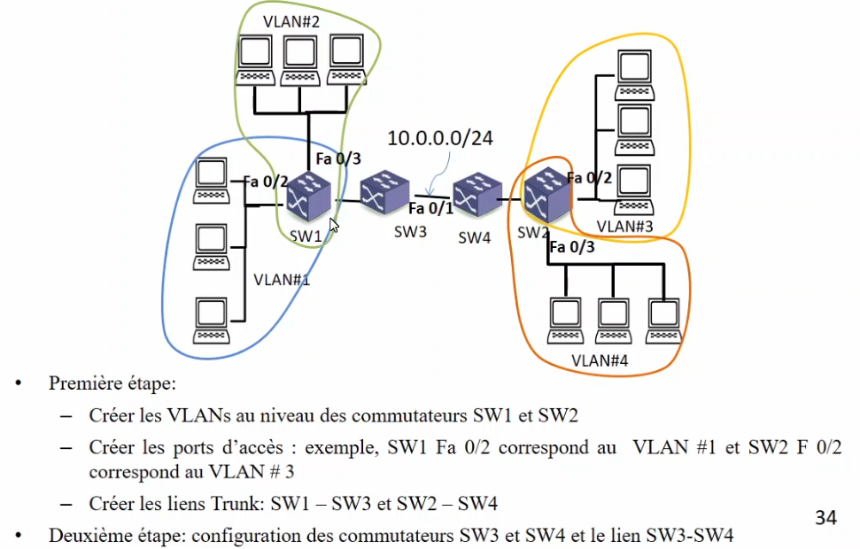
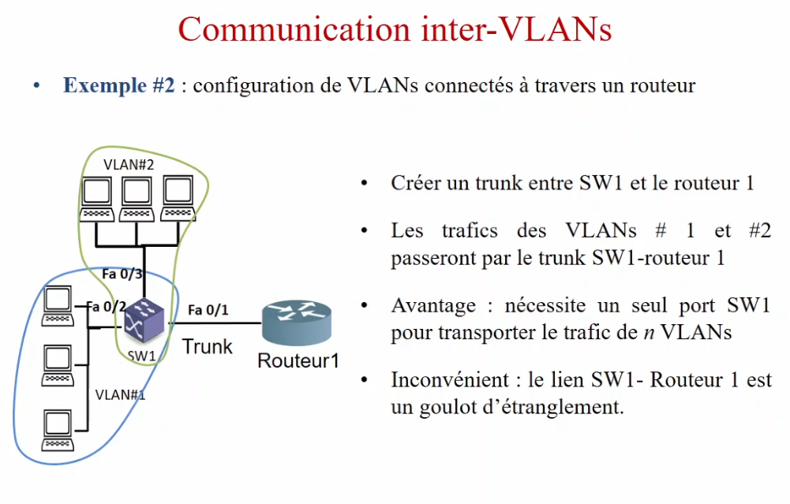
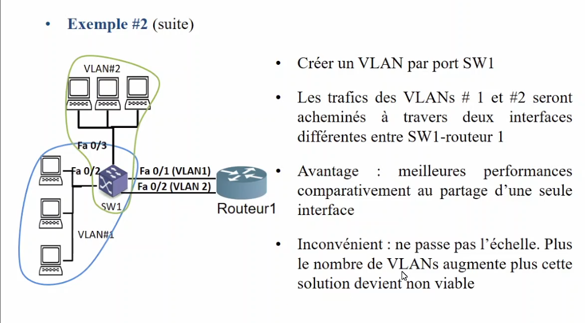

# Cours 4

## Protocol NDP

#### Types de messages :

- Messages NA (Neighbor Advertisement): annonce d'un voisin. Messages périodiques de présences envoyés par les noeuds et contenant les adresses couche liaison
- Message NS (Neighbor Solicitation): Message envoyé par un noued pour la découverte d'une adresse couche liaison d'un voisin (résolution d'adresse couche 3 à couche 2)
- Message RA (Router Advertisement): message envoyé par un routeur soit périodiquement, soit en réponse à un message RS. Message destiné à tous les noeuds connectés au routeur. Distribution des params nécessaire à la configuration automatique des adresses IP et au routage (MTU, nombre max de sauts...)
- Message RS (Router Solicitation) : Message envoyé par un hçpte pour demander à tous les routeurs du réseau d'envoyer des annonces RA
- Messages DAD (Duplicate Address Detection): messages envoyé par un noued permettant de détecter des adresses dupliquées (cas d'adressage combiné statique et SLAAC)

### Entetes d'extension

remplace la partie option présente dans l'adresse IPv4

Les informations optionnelles sont encodée dans des en-tetes séparés, enchaines entre l'entête de la base de IPv6 et l'en-tête de transport

Data gramme IP = Entête IP et la charge utile - Charge utile est un segment TCP ou UDP

ICMP peut etre encodés dans un datagramme TCP/UDP

Numéros pour identifier chaque type de message

- OSPF : protocole de routage

extensions entetes passe rapidemnt car il n'y a pas de champ d'option, lecture plus rapide.
1 seule extension d'entête peut etre traiter par le retour

ESP = entetes d'encryptage

En IPv4, les numéros sont écrits dans le type de protocole. En IPv6, c'est les entêtes suivantes

##### Construction adresse IPv6

partie identificateur interface - construit à partir de l'adresse MAC, et une adresse Lien locale (FE80)
Avec cette adresse, elle découvre son voisinage

Si elle trouve un routeur, elle obtient son préfixe réseau

### En-tête d'extension

- À part une ecveption, les entêtes ne sont traités que par le ou les noeuds (multicast) de destination

- Le premier ent^te est traité et une information permet de savoir s'il faut traiter l'entete suivante. Les entetes sont donc traités selon l'ordre de transmission

Le routeur n'a pas besoin de lire les extensions d'entêtes. Un seul type d'extension est traité par le routeur.

- Hop by Hop , si présente, c'est la première suivant l'entête IPv6

- ESP est une extension de protection
- Extension d'entête de routage
- Extension d'entête de fragmentation

- Hop by Hop est tt le temps la première : (00)
- Destination (60) : données facultatives devant etre vérifiés par le noude de destination
- Routing (43) : routage étendu im posant à un paquet une route différente
- Fragmentation (44) : Fragmentation et réassemblage
- Authentification (51) : authentification et intégrité des données
- Security (50) : Chiffrement des donnés à protéger - Encapsulating Security Payload

#### Hop by Hop

- Exception à la règle : traité par tous les noeuds, incluant la source et la destination
- Doit suivre immédiatement l'entête IPv6, présence indiqué par la valeur 0 du champ Next header de l'entête IPv6

#### Destination

- Présence indiqué par la valeur 60 du champ Next Header de l'entête IPv6

**Next Header : identifie le prochain type d'entête qui est inclus dans le paquet IPv6**
**Header Ext. len.: Longueur de l'entête Options en multiple de 8 Octets. Cette longueur n'inclut pas les premiers 8 Octets**

#### Routing

- Identifié par 43
- utilisé par la source pour spécifier les noeuds intermédiaires devant etre visités sur le chemin vers la destination
- pour s'en assurer, l'adresse de destination est modifiée pour le prochain noeud à visiter
- Routing type : identifie une variante particulière de l'entête Routing
- Segment left : nombre de segments de routes restants, Nombre de noeuds intermédiaires à visiter avant d'Atteindre la destination finale
- Type-specific Data : Format déterminé par le routing type. Longueur variable, multiple de 8 octets

#### Authentification et Securité

- Pour la protection contre les attaques actives (falsification de données et de transactions) l'authentification de message est utilisée
- L'authentification en communication de vérifier que les messages recus sont authentiques . Autrement dit :
  - Le message provient d'une source authentique
  - le message n'a pas été altéré
- Pour la protection contre les attaques passives, le cryptage est utilisé. Il permet de rendre illisible le message pour celui qui ne possède pas la clef

#### Authentification

SPI : la combinaison du SPI avec l'adresse de destination forme un identificateur unique pour l'association de sécurité

- Entre une même source et une destination, il pourrait exister plus d'un échange authentifié.

SNF : Utilisé pour éviter des attaques de type rejouer ou un attaquant tenterait de transmettre un paquet qu'il a captéà

Authentification Data : Contient la valeur integrity Check Value calculée par la source. La longueur de ce champ dépend de la technique d'authenfication utilisée.

### Déploiement

- Déploiement IPv6 est limité
- Complique en raison de l'incomptabilité des adresses IPv4 et IPv6
- Progression de IPv6 suretout dans le coeur d'internet

### Techniques :

#### Transport de paquet IPv6 d'une périphérie à une périphérie , en passant par un réseau cour IPv4

- Envoyer les paquets IPv6 dans des tunnels IPv4
- les bouts doivent supporter IPv4 et IPv6

- Nécessite double pile de protocoles

#### Double pile de protocoles

- Avoir les deux réseaux à même temps
- avoir les deux espaces d'adressage
- interface de programmation d'application API qui supporte aussi bien IPv4 et IPv6

requiert :
mise à jour de toute l'infrstructure
deux types d'Adressages
deux types de gestion de réseaux
deux types de table de routage

Applicable :
infrastructure spécifique avec un mixage IPv4 et IPv6
réseau universitaire
points de présences des fournisseurs d'accès internet

#### Conversion de paquet IPv4 en IPv6 et vice versa à la périphérie

Traduction :
deux possibilité

- Pas de changement de la couche réseau (IPv4/IPv6)
  - mécanisme de relais niveau TCP UDP
    - serveur dédié avec une double pile
    - deux connexions au niveau transport Connexion Ipv4 et IPv6
  - Changements à IPv6/IPv4
    - Couche logicielle au dessus de IPv6 ou IPv4 pour interagir avec la couche transport
      - Mappage d'Adresse
      - Traduction et autres
- Applicabilité

## VLANS

**besoins**

- LImiter la diffusion dans le sréseaux
- interconnecter plusieurs réseaux distants
- isolation entre les réseaux
- décentraliser les lans a travers différents réseaux

- Un VLAN permet de segmenter de grand réseaux en des réseaux logiques (restreindre l'espace de diffusion)
- Chaque réseau logique regroupe de smachines/utilisateurs selon des critères (ex numéro de port, adresse MAC, protocole de communication)
- Les machines/utilisateurs peuvent se trouver dans des localisation géographiques

### Principes de bases :

- Garanti une segmentation virtuelle des réseaux
- les vlans assurent une isolation entre le ssegments logiques de la topologie du réseau LAN. Seules les machines appartenant à un même VLAN peuvent communiquer entre-elles
- les VLANS sont des domaines de diffusion fermés qui ne communiquent entre eux qu'a travers des routeurs
- Les ports des commutateurs sont configurés afin qu'il soit associés à un VLAN spécifique
- Les machines sont connectés aux ports qui sont associés au VLAN approprié et non pas a commutateur spécifique comme c'est le cas d'un réseau sans VLAN. Donc une machine qpeut etre connecté à n'importe quel commutateur du moment qu'elle est associée au VLAN appropriés

#### Avantages :

- réduction des couts d'infrastructure et de gestion puisqu'il est possible de connecter plusieurs VLAN à un même commutateur
- Plus de flexibilité pûisque les machines sont regroupées d'une manière logique et non plus physique. Un vlan peut etre connecté à plusieurs commutateurs et les machines deviennent nomades avec différentes localisations géographique

### Types de VLANs

- Niv 1 Niveau physqique / ports : ensemble de machines appartenena tà un même réseau physqique. Ces machines sont regroupés selon les numéros des ports physiques qui sont assignés à chaque VLAN
- Niv 2 Niveau liaison : ensemble machines appartenant à un VLAN regroupées selon leurs adresses MAC source ou destination (besoin d'une DB)
- Niv 3 Niveau réseau : ensemble de machines regroupées selon leurs adresses de niveau 3 (adresse IP source ou destination)

Diverses configurations :

- Les machines d'un même VLAN peuvent avoir des localisations géographiques différentes (niv 2 et 3)
- Les machines peuvent etre déplacées
- Le routage peut ou non être intégré dans un commutateur (niv 3)

#### VLAN niv 1

les ports des commutateurs sont réservés à des VLANS  
exemple : les ports 1,2 3 du commutateur S@1 sont associés au VLAN#1 et les ports 456 sont associées au VLAN#2

- L'isolation entre VLANs es complète
- Cout important d'administration des VLANs :
  gestion manuelle de la distribution des VLANs
- Deplacement d'une station d'un VLAN plus difficile

#### VLAN niv 2

les adresses MAC des trames recues sont associées à des LVANS. Gestion des tables d'adressage per l'administrateur du réseau

- les ports du réseau d'un commutateur sont attributés dynamiquement à chaque VLAN en fonction de l'adresse MAC de la machine
- Déplacement d'une machine d'un VLAN plus facile. Lorsqu'elle est déplacée son adresse MAC ne change pas et donc continue à appartenir au même VLAN

#### VLAN niv 3

Les adresses IP des trames recues sont associées à des vlans

- les ports d'un commutateur sont attribués dynamiquement a chaque VLAN en fonction de l'Adresse IP de la machine
- Processus plus lent : un commutateur doit identifier l'adresse de niveau 3 d'une trame pour déterminer à quel VLAN elle appartient
- SWI et SW2 sont des commutateurs de niv 3

#### Types de ports VLAN

**Les ports Access**

1. ensemble de ports d'un commutateur auxquels des machines sont connectés
1. cest ports doivent etre configurés pour etre associés à un VLAN
1. les ports access permettent d'associer les machines aux VLANs appropriés

**Les ports trunks**

1. ensemble de ports permettant de connecter les commutateurs entre eux
1. ces ports doivent etre configurés en mode Trunk pour offrir l'accès au trafic provenant de plusieurs VLANs
1. un lien entre deux commutateurs est configuré en mode trunk pour laisser passer les trames de plusieurs VLANs

- une fois l'interface est configurée en mode Trunk, l'interface auquelle la première interface est relie sera configuré en mode trunk automatiquement
- une fois configuré en mode Trunk, le lien laissera passer les trames des VLANs 1 et 2
- les commutateurs utiliseront les VLAN IDs poru déterminer vers quel VLAN chaque trame recue sera transférée

#### VLANs natif

à travers un lien trunk, nous retrouvons un VLAN natif

- un VLAN natif permet de laisser passer les trames recues nb'ayant pas de VLAN ID sur un lien Trunk (ex, trames STP et trames de négociation de Trunk selon le mode de fonctionement du port)
- tous les ports d'un commutateur sont associés au VLAN natif
- par défaut, le VLAN natif est le VLAN 1 qui est configuré des deux cotés d'un lien Trunk

##### VLAN en trunk

- la configuration en trunk permet d'insérer un identifiant du VLAN dans chaque trame de niveau 2
- Chaque commutateur configuré en Trunk insère un TAG dans chaque trame qu'il recoit d'une machine / utilisateur

#### VLAN trunking Protocol (VTP)

- VTP facilite la configuration des VLANS en diffusant leurs configuration a travers un réseaué Ainsi, tout ajout, suppression ou modification d'un VLAN au n iveau d'un commutateur serveur VTP, sera propagé d'une manière automatique vers les commutateurs clients
- VTRP permet de répliquer les VLANs mais ne permet pas de configurer les ports Access et Trunk. Ces derniers doivent être configuérrés à part.
- Le protocole VTP définit les paramètres essentiels suivant :
  - le nom de domaine VTP : délimite les frontières d'échange du protocole VTP dans un réseaué Les commutateurs doivent appartenir au même domaine VTP pour recevoir les message VTP des voisins.
  - Le mode VTP : un commutateur peut avoir différents modes de fonctionnement VTP : serveur, client ou transparent
  - Numéro de révision : correspond à la version de la bse de données des VLANs. Ce numéro augmente à chaque modification des configurations des VLANs

#### Modes VTP :

- **serveur** : un administrateur de VLANs ayant accès à un commutateur configuré en mode serveur VTP peut ajouter, supprimer et modifier des VLANs. Un tel commutateur diffuse ces informations de configuration à tous les commutateurs du réseau qui appartiennent au même domaine VTP
- **client** : un commutateur qui recoit et propage les informations de configuration VLANs à des commutateurs voisins. Il ne peut pas être utilisé pour ajouter, supprimer etm odifier des VLANs
- **transparent** : un commutateur configuré en mode transparent permet de modifier des VLANs configurés manuellement en local et de transmettre les informations de configuration automatique des VLANs à des commutateurs voisins

#### VTP pruning

- VTP pruning empçeche de propager les informations de broadcast VLAn vers tous les commutateurs
- Exemple :

  - Le VTP pruning évite de propager les informations de broadcast vers le commutateur SW2, SW4 et SW4
  - Ainsi, le trafic provenant des machines du VLAN #1 ne passe que par les commutateurs SW1, SW5, SW6
  - VTP pruning est configuré au niveau du commutateur serveur VTP les commutateurs client VTP héritentn automatiquement du mode VTP Pruning

  

#### Communication inter-VLANs

Deux VLANs peuvent communiquer à travers un routeur ou à travers un commutateur niveau 3
Un commutateur niveau 4 inspecte les adresses IP et MAC d'un paquet avant de l'acheminer à travers le réseaué. Il est capable d'effectuer du routage

