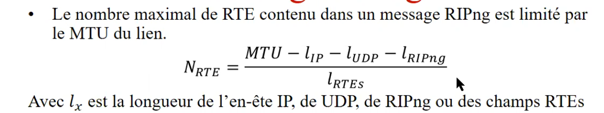
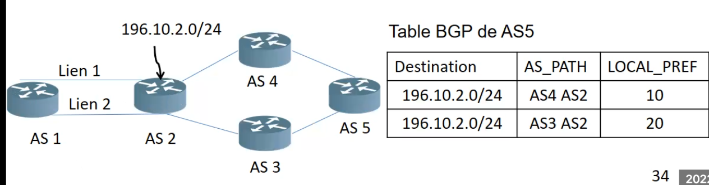

# Routage

on parle de transfert de paquets - selon les informations de la table de routage

- La table de routage contient des routes
- comment atteindre un réseau d'adresses : selon ce chemin là.

## Classification des algorithmes de routage

### Routage IPv6

Deux familles de protocoles pour le routage dynamique :

- protocoles internes au domaine (IGP : Interior Gateway protocol)
- Les protocoles externes au domaine (EGP : External Gateway protocol)

Routage statique vs dynamique

### Dynamique

Algorithme qui statique
Algo qui s'exécute et qui rempli la table de routage

- Algorithmes internes
  - IGP - Internal Gateway protocol : 1 seul organisation , décide tt ce qui se passe à l'intérieur, décide des coûts, Granularité : routeur
- Algorithmes externes
  - taille c'est l'internet , administration = cooperation d'entitées indépendantes, granularité : AS

Par rapport aux systèmes autonomes (Internet est un ensemble de système autonomes interconnectés) - ensemble de réseaux avec un seul gestionnaire

### Statique

routes statiques, les routes sont ajoutées par l'admin dans la table de routage
Pas utiliser pour lkes réseaux tres vastes

Au niveau d'un routeur : Routes à ajouter

le reseau 1 (joue le role de passerelle par défaut), le reseau d'interconnexion auquel il est connecté

##### types de routage :

routage interne RIP, OSPF
routage extern BGP-4 BGP-4 multiprotocoles (MP-BGP)

##### Coexistence de IPv4 IPv6

- Routage dual-stack
- Transmission tunnel de IPv6 à travers IPv4
- Interconnexion de IPv6 avec IPv4 (NAT64)

#### Objectifs principaux

- supporter des milliards d'hotes
- réduire la table de routage : meilleure aggrégation de routes dans les tables de routage
- simplifier le protocole - achemoinement des datagrammes plus rapidemment
- améliorer la sécurité : authentification, confidentialitéq

## Routage interne

Routage à lÉ'intérieur des domaines ou des systèmes autonomes (SAs)

- Consiste à trouver le meilleur chemin à travers lequel les paquets seront acheminés à l'intérieur d'un système autonome

RIP et OSPF : deux protocoles de routage internes utilisés sur internet

### RIP : Routing information Protocol

- Routage à vecteur de distance : (algorithme Bellman-Ford)
- chaque routeur maintient sa propre table de routage qui liste le cout pour chaque destination
- cout : nombre de sauts (15 sauts maximum)
- chaque routeur partage les informations qu'il détient au sujet du plus court chemin avec ces voisins
- chaque routeur transmet ces informations à des intervalles de temps fixés (ex : chaque 30s)
- rip encapsule ses messages dans un segment UDP

### OSPF :

- routage à état de liens 9algo de djisktra)
- les états des liens sont partagés entre les routeurs
- cout : bande passante de référemce 100mbps/bande passante de l'interface
- chaque routeur transmet l'information d'état de son voisinage à chaque routeur de la région (c'est de la diffusion)
- l'information d'état de lien est transmise en utilisant le processus d'inondation (à tt le monde)
- l'information n'est pas partagée périodiquement, mais quand il y a un changement
- supporté par la plupart des routeurs et implanté dans la plupart des SAs
- Encapsulé directement dans IP

### RIP

rip v1 et rip v2
RIPv1 - 512 octets max, nombres de destinantions (nombre de sauts = 15 max)
RIPv2 est classless - il possède un champs pour le subnet mask | un champ pour le next hop

RIPv1 ne tient pas compte des masques, il s'effectue selon les classes (A,B,C,D,E)

Le nexthop est plus performant avec RIPv3
le prochain saut est le routeur qui envoie
nexthop : quand tu veux envoyer le paquet vers un autre reseau que le routeur partageant l'info - pour les environnements avec plusieurs algorithmes de routage

### Messages RIP

deux types de messages : requetes - reponses

requetes : envoyé aux routeurs voisins leur demandant de transmettre tout le contenu ou une partie de latable de routage
reponse : contiennent les mises à jour demandées

- Toutes les 30 sec, une partie ou tout le contenu des tables de routage est ransmis aux voisins dans les messages de réponses
- S'il y a changement de la métrique d'une route, tout le contenu de la table est transmis
- Un routeur voisin devient injoignable, s'il n'envoie aucun message durant 180 sec

#### RIPv1

- utilise l'adrresse broadcast pour partager l'information (255.255.255.255)
- protocole Classful - on ne transmet pas le mask
- envoie de mise a jour RIPv1
- Reception de mises a jour RIPv1 et RIPv2
- pas de support d'authenfication

avantages :
-tres simple

- peu de ressources
- simple a metre en oeuvre et a configurer
- disponible sur une large gamme de périphériques

desavantages :

- temps de stabilité long suite a un changement dans le réseau
- comptage infini - si un reseau est deconnecter, il va rester phantome et la taille du réseau serat tt le temps augmenter
- nombre de sauts limité à 15
- ne prends pas en compte d'autres types de couts
- Comptage infini . L'approche horizon partagé permet de contourner ce problème (pas le droit de share l'information obtenu d'un autre routeur, à ce même routeur)

#### RIPv2

- utilise l'Adresse multicast 224.0.0.9 pour partager l'information
- protocole classless - information du subnet est transmise dans les mise a jour de routage
- supporte classful et VLSM
- envoie de mises a jour RIPv2
- reception de mise à joeurs RIPv2
- support d'authentification simples des messages de mises à jour

### Message RIPng

- Version IPv6
  

deux types de messages : requetes / reponses

requetes :

- envoyé aux routeurs voisins leur demandant de transmettre tout le contenu ou une partie de la table de routage
- tout le contenu d'une table est tranmis lorsqu'une seule RTE avec un préfixe de destination nul, une longueur de préfixe nulle et une métrique de 16 est recus

réponse :
les entrées de routes (RTEs) contenues dans un message requ^çete sont examinés une à une. Pour chaque entrée :

1. rechercher la destination dans la base de données de routage du routeur
1. Mettre la métrique de la route identifiée dans le champ correspondant du RTE sinon mettre la valeur infinie
1. Une fois toutes les entrées ont été traitées, changer la commande requête en commande réponse et la transmettre au routeur qui a transmis la requête

- Voisin devient injoignable, s'il n'envoie aucun message durant 180 sec
- split horizon : permet d'éviter de transmettre les mises à jour des routes aux voisins à partir desquels ces routes ont été annoncées

### RPIv2 vs RIPng

RIPv2 :

- utilise l'adresse muiilticast 224.0.0.9 pour partager l'info
- protocole Classless
- Envoie de mises a jour RIPv2
- Rececption de mises a jour Ripv2
  Support d'authentification simple des messages de mises a jour

RIPng

- utilise l'adresse multicast IPv6 pour partager l'info
- protocole classless
- support d'authentification des messages de mises a jour IPsec

### Paquets OSPFv2

À état de liens: c'est ce que le routeur partage

LSA (Link state advertisement)

Les annoncnes :

- message Hello : paquets transmis périodiquement à l'adresse multicast 224.0.0.5 à travers toutes les interfaces unicast. Il permet de découvrir les lrouteurs voisins et de maintenirs les relations avec eux
- Database Description packets : indique l'état des interfaces d'un routeur, l'ensemble des routeurs attachés au réseau, résumés des routes vers les réseaux (transmis par l'ABR = Area Border Router) et les routes vers les destinations extyernes au AS (Autonomous System)
- Link State Request Packets : utilisé pour demander une partie de la base de données d'un voisin qui détient une mise à jour la plus récente
- Link state update : Chaque paquet transporte un ensemble de LSAs qui sont transmis en mode mul ticast vers les coisins
- State ACK packets : C'est paquets accusent réception des LSAs transmis en mode mulitcast dans des paquets LSU (Link state update)

OSPFv2 réseau divisé en zones

routeurs de frontières : partages des info entre les zones
a l'interne : des routeurs internes

- pour ne pas saturer les liens, tt le monde n'envoit pas a tt le monde
- tt le monde envoie a un routeur designé qui transmet l'information par après

### OSPFv3 pour IPv6

On rajoute l'instance ID en IPv6, car on peut avoir plusieurs adresses IPv6 sur un liens
1 adresse multicast, unicast

#### Routage interne OSPFv3

v2 :

- utilise l'adresse multicast 224.0.0.5 pour partager l'information avec tous les routeurs OSPFv2 et 224.0.0.6 avec les routeurs désignés
- Authentification des messages de meses à jour basée sur un clé partagée et MDG5-HMAC (Message Digest 6 = Keyed-Hash message Authentication Code)

v3 :

- Utilise les adresses : ff02::5 pour le partage d'information entre tous les Routeurs OSPFv3 et FF02::6 avec les routeurs désignées
- OSPFv3 permet de créer plusieurs instances OSPF à travers un seul lien
- Authentification basée sur IPsec

## Routage Externe

## Routage entre ASs ( Autonomous Systems) bas. sur des contraintes d'échange d'information d'inter-connectivité

Protocole utilisé : Border Gateway Protocol (BGP)

- un noeud peut établir différentes sessions BGP
- un noeud BGP peut annoncer une partie ou toutes les routes disponibles qu'il désire partager avec ses voisins. Il peut aussi annoncer les changements reliés à la disponibilité de ces routes
- un noued BGP sélectionne les routes apprises de ses voisins. Il peut donc accepter ou refuser un message d'un voisin selon les contraintes de routage.
- Sousmis à des contraintes politiques et de sécurité configurées manuellement. Exmples :
  - trafic sortant d'uine compagnie ne doit pas passer par une compagnie concurrente
  - le trfic venant du pentagone ne doit pas transiter par des ASs non situés en Amérique du Nord
  - le trafifc ne doit pas passer par certains pays en guerre

#### BGp

version améliorée de l'algorithme vecteur de distance

- stratégie de routage :

  - client : les ASs qui adoptent cette stratégie de routage ne peuvent pas servir à l'acheminement de trafic de transist
  - pair : les ASs agissant comme pair acheminement du trafic de transit, sauf indication contraire (interconnexion entre deux ASs)
  - transit : agissent comme AS intermédiaire pour l'acheminement de trafic, généralement moyennant finance

- Dans la stratégie de routage client-fournisseur, un AS client achète un service auprès d'un autre AS qui est fournisseur. L'AS client paye pour que le fournisseur lui achemeine le trafic et lui donne accès aux autres ASs. L'AS client s'attend aussi à ce que l'AS fournisseur annonce le chemin vers lui pour qu'il soit accessible à travers le réseau
- Dans une stratégie de routage pair-à-pair, chacun des deux ASs pairs accepte de transporter le trafic de l'autre et de partager ses routes avec lui. Ces ASs fournissent le plus souvent des routes moins longues que celles founris par un AS fournisseur

##### Politiques de routage :

- Relation asymétrique entre client-fournisseur

1. un AS client doit payer pour une connectivité à l'internet
1. Un AS client transmet ses routes internes et celles apprises de ses clients au AS fournisseur
1. Un AS fournisseur annonce les routes de l'AS client sur internet
1. un AS fournisseur annonce toutes les routes qu'il connait au AS client

- Relation symétrique entre AS pairs

1. les AS pairs s'échangent entre eux gratuitement les routes qu'ils connaissent
1. chaque pair transmet ses routes et celles apprises par ses clients. Et selon l'entente entre ces AS pairs, ces derniers peuvent s'échanger d'autres routes apprises par d'autres AS (même fournisseurs)

Pour le routage externe : deux manieres de trouver les meilleurs routes

- Un AS transit autorise l'utilisation de son infrastructure réseau par d'Autres AS moyennant un paiement
- Un AS préfère les routes via un AS client, pous les orutes via les ASs pairs et ensuite les routes via les ASs fournisseurs

##### BGP est fondamentalement un portocole à vecteur de distance, avec quelques différences

- BGP mémorise toutes les routes vers toutes les destinations, pas seulement la meilleure sur l'ensemble des routes sélectionnées
- Pas de transmission périodique des meilleures routes, mais uniquement des modifications
- BGP consigne le chemin en entier vers les différentes destinations. (Un chemin com porte le routeur prochain, la liste des AS traversés et un ensemble d'attributs)

##### message BGP-4

Les messages BGP-4 sont transportés à travers TCP (# de port 179)

Messages :

- OPEN : premier message envoyé par chaque AS après l'établissement de la connexion TCP entre deux ASs. Permet d'établir une session BGP
- KEEPALIVE : Transmis pour suivre l'état de la connexion entre les pairs AS dès que le message OPEN est accepté. Il permet d'informer un voisin que la connexion est valide
- UPDATE : utilisé pour transmettre les ifnormations de routage entre deux pairs BGP. Il peut simultanément annoncer les routes actives vers un pair et supprimer les routes inactives
- NOTFICATION : envoyé lors de la détection d'erreur. La connexion BGP est fermée immédiatement après l'envoi de ce message

##### Terminologie BGP

- AS (autonomous System) : un système autonome est un ensemble de routeurs gérés par un domaine administratif. Il utilise un routage interne avec les même métriques de routage pour l'acheminement des paquets à l'intérieur du AS et un routage externe pour le transfert des paquets vers d'autres ASs
- BGP ID : identifiant BGP de l'expéditeur des messages BGP. Cet identifiant représente l'adresse IP assignée à cet expéditeur BGP. Il est transmis dans le message OPEN
- ROUTE ACTIVE : route annoncée par un expéditeur BGP et qui peut çetre utilisée par le récepteur BGP
- Expéditeur/récepteur BGP : un routeur qui implémente BGP
- PATH attributes : information contenu dans un message UPDATE permettant de sélectionner la meilleure route vers un récepteur BGP
- NLRI (Network Layer Reachability Information) : information spécifiant le préfixe de l'Adresse d'un réseau BGP et sa longueur. Un message UPDATE contient un seul champ NLRI

- Une route est une unité d'information qui relie un ensemble de destinations aux attributs d'un chemin vers ces destinations. Ces destinations sont des systèmes autonomes dont les adresses IP sont contenues dans un préfixe d'adresse IP (NLRI)
- Les routes sont annoncées entre les routeurs BGP dans des messages UPDATE. Plusieurs routes qui ont les mêmes attributs de chemin (Path Attributes) peuvent çetre annoncées dans un seul message UPDATE en incluant plusieurs préfixes dans le champ NLRI d'un message UPDATE

##### Attributs d'un chemien BGP

**Attributs du chemin obligatoire sont :**

- ORIGIN : attribut géméré par l'expéditeur qui a prpoduit l'annonce de routage
- AS_PATH : liste de tous les ASs à travers lesquels l'annonce d'une route spécifique est transmise jusqu'à la destionation. Chaque AS de cette liste ajoute son identifiant dans cet attribut lorsqu'il transmet l'annonce
- NEXT_HOP : attribut qui définit l'adresse IP du routeur qui représente le prochain saut vers la destination.

Autres attributs du chemin :

- Multi-exit discriminator (MED) (optionnel) : permet de choisir un lien parmi plusieurs établis avec un AS voisin. Ex : si l'AS2 indique le lien # 1 avec un MED plus faible que celui du lien #2, alors l'AS1 utilisera le lien #1 pour transmettre l'information de routage
- LOCAL_PREF (requis)ermet d'indiquer les degrés de préférence pour des chemins ayant un même préfixe. Le degré le plus élevé sera sélectionné. Ex : l'AS5 choisira AS3 pour atteindre l'adresse de destination 192.10.2.0/24

### Processsus de routage BGP décision :

**processus de décision :**

- Vérifier les attributs
- selectionner la route avec le plus élevé LOCAL_PREF
- si plus d'une route possède le même niveau de préférence, sélectionner la route ayant l'AS_PATH le plus court
- si plus d'une route existe avec un AS_PATH le plus court, sélectionner la route en se basant sur le MED
- Sélectionner le prochain saut en se bassant sur des métriques du chemin IGP, s'il en existe plusieurs, alors le sélectionner en se basant sur BGP DI

#### Processus de routage BGP : entrée-sortie

**à la sortie :** permet de controler l'information partagée avec les autres ASs

- Filtrage : il peut être basé sur les préfixes IP et l'AS_PATH
- Filtrage : accepter ou non de transmettre un prégixe de route à des ASs qui peuvent traverser notre AS (ex. si notre AS n'est pas Transit et qu'un AS n'est pas notre client, alors empçecher la transmission)
- Gestion des attributs : permet d'établir les priorités entre les pairs BGP parmi les routes acceptés (ex. LOCAL_PREF)

**En entrée** Permet de controler l'information provenant des pairs

- Gestion d'attributs : Mettre à jour le AS_PATH et le MED
