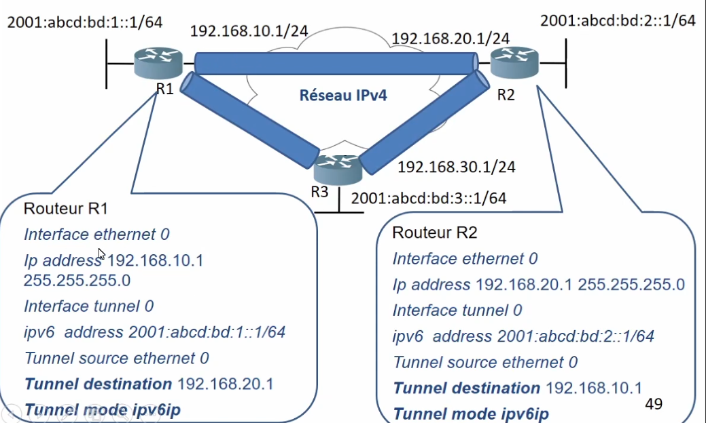
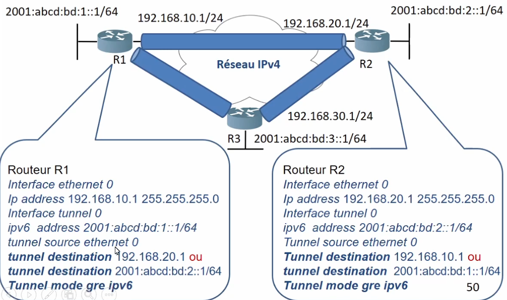
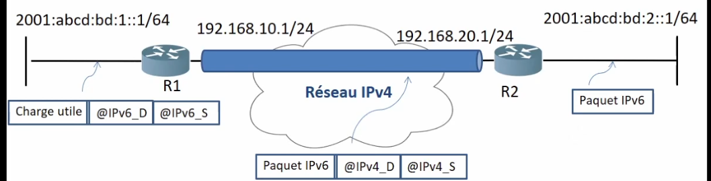
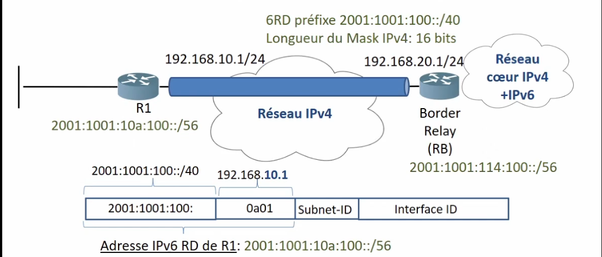
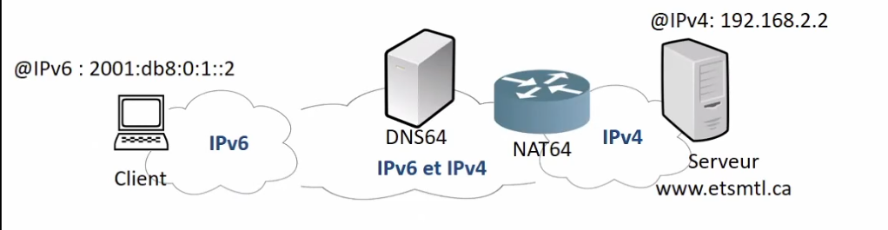
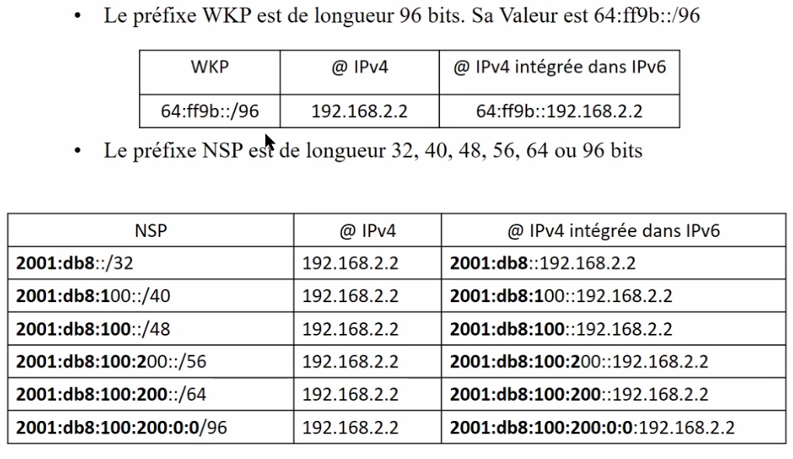
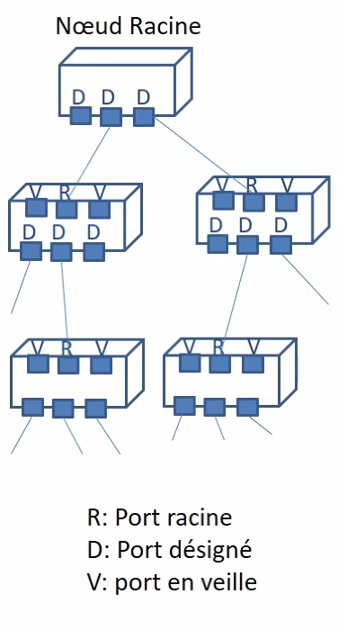

# Cours 6

### Routage Dual Stack

- Le routage Dual-Stack est un routage qui permet d'acheminer simultanément du trafic IPv4 et IPv6 à travers des liens partagés. Ce type de routage offre une stratégie flexible de coexistence IPv4 et IPv6
- Le transfert du traffic OIPv6 est désactivé par défaut dans un routeur. Pour activer le protocole IPv6 dans untel équipement, il faut exécuter la commande _ipv6 unicast-routing_ et assigner une/des adresses IPv6

Il faut maintenir 2 réseaux pour cela.

### Transmission tunnel de IPv6 à travers IPv4

- Il existe plusieurs mécanismes d'établissements de tunnels permettant la transmission de paquets IPv6 à travers un réseau IPv4
  - Manuel
  - GRE (Generic Routing Encapsulation)
  - 6to4
  - 6RD
- Les extrémités du tunnel doivent être configurées Dual-Stack (IPv4 et IPv6)

#### IPv6 à travers IPv4 - Manuel

- nécessite n(n-1)/2 tunnels avec n = nombre de site
- exemple : 10 sites nécessitent 45 tunnels pour une conectivité full Mesh
  

#### IPv6 à travers IPv4 - GRE

On peut donner la destination soit en IPv4 ou IPv6

#### IPv6 à travers IPv4- 6to4

- Tunnel automatique
- On fixe la source, mais la destination est intégrée dans l'adresse IPv6

si l'adresse commence par 2002 : c'est un tunnel 6to4

- Un paquet IPv6 ayant une adresse source @IPv6_A 2001|abcd|bd|1||1/64 et unadresse destination @IPv6_D 2001|abcd|bd|2||1/64 est transmis à travers le réseau IPv4
- R1 recoit le paquet IPv6, compare @IPv6_D avec ses adresses IPv6 dans sa table de routage et trouve une correspondance avec l'adresse statique 2001|abcd|bd|2|1/64 avec le prochain saut 2002|c0a8|1401||
- R1 identifie une deuxième correspondance entre l'adresse 20012c0a8|1401|| et le tunnel 0 de sortie
- Le mécanisme 6to4 encapsule le paquet IPv6 dans un paquet IPv4 avec @IPv4_S=192.168.10.1 et @IPv4_D=192.168.20.1
- Le paquet sera acheminé jusqu'au routeur R2 qui restituera le paquet IPv6

#### IPv6 à travers IPv4 - 6RD

1. Même stratégie que 6to4, mais on utilise un prégixe IPv6 natif (fourni par un FAI) au lien de 2002::/16
1. FAI fournit un prégixe 6RD IPv5 par exemle : 2001|1001|100||/40
1. Un domaine 6RD spécifie la longueur commune du prégixe IPv5 des routeurs. Exemple, préfixe égal à 16 bits.
1. L'adresse IPv6 RD est construite à partir du préfixe IPv6 2001|1001|100 et du suffixe IPv5 transféré en hexadécimal

Tunnel automatique

#### Interconnexion IPv6 et IPv4 - NAT64

- Permet à une machine IPv6 (ex. un client) de se connecter à une machine IPv4 (ex. un serveur)
- NAT64 (Netowrk Addres translation IPv6 à IPv4) permet de translater une IPv6 en une adresse IPv4 publique

  - Nat64 sans états (stateless) : Faire correspondre une adresse IPv6 à une adresse IPv4
    - Nécessite un nombre important d'adresses IPv4 publiques
  - NAT64 avec états ( statefull) : Faire correspondre plusieurs adresses IPv6 à une adresse IPv4
    - Exige le maintien des états des sessions établies entre le client et le serveur. L'état contient les correspondances entre l'adresse IPv6 et du port de transport TCP/UDP associé à l'adresse IPv4 et le port de transport TCP/UDP correspond

- Un préfixe NAT64 est utilisé lorsqu'un utilisateur A localisé dans un réseau IPv6 établit une communication vers son correspondant B situé dans un réseau IPv4
- Un préfixe IPv6 connu (WKP - well known prefix) ou spécifique à un réseau (NSP - network specific prefix), est dédié pour établir la correspondance avec l'adresse IPv4
- Le routeur NAT64 annonce le préfixe NAT64 dans le réseau IPv6 pour le trafic qui doit être transféré vers un réseau IPv5
- NAT64 doit s'associer avec DNS64 pour atteindre le correspondant qui se trouve dans le réseau IPv4
- DNS64 (Domain Name System IPv6 à IPv4) permet à A d'atteindre B à travers un réseau IPv6
- Le DNS64 permet de convertir les enregistrements A en des enregistremewnt AAAA en utilisant le préfixe NAT54é Les enregistrements A et AAAA sont attribués aux utilisateurs

- NAT64 possède des interfaces pour se connecter au réseau IPv6 et des interfaces pour se connecter au réseau IPv4
- Lorsque le NAT64 recoit un paquet avec une adresse IPv6 de destination qui nécessite d'être traduite (ex. @ WKP 64|ff9b||192.168.2.2), il la convertit en une adresse IPv4
- NAT64 transfert l'Adresse convertie à rtavers l'interface IPv4
- NAT64 maintient dans sa table de correspondance l'@ du client vers qui il transférera cette réponse

##### Préfixes possible :

WKP (well known prefix): est de longeuur 96bits. sa valeur est 64|ff9b||/96
NSP est de longueur 32, 40, 48,56,64 ou 96

# Partie 2 du cours

## VLANs

- Sachant que la topologie des réseaux Ethernet est maillée (avec des chemins redondants) et afin d'éviter la présence de boucles de commutation lors de la diffusion des trames, différentes approches du protocole Spanning Tree (STP - Spanning Tree Protocol) sont utilisées

- Un arbre : pas de cycles/boucles

- STP est un protocole de couche 2 qui s'exécute sur des commutateurs. Il permet de supprimer lesboucles de commutation dans un réseau

### Protocole Spanning Tree (STP)

**Pour supprimer les boucles de commutation (désactiver les chemins redondants), le protocole STP doit :**

- Désactiver certaines liaisons entre les commutateurs d'un réseau en mettant les ports dans un des deux états suivants :
  - État passant : échange de trames de données et trames STP
  - État bloquant : Échange de trames STP seulement (le port recoit, traite et émet des trames STP)
- Élire un noeud racien qui devient le point central du réseau par rapport auqeul les décisions du réseau sont prises telles que l'Architecture logique à adopter

Ainsi, chaque VLAN doit avoir son propre noeud racine, car chacun d'entre eux représente un domaine de diffusion distinct. Ces noeuds racines peuvent être hébergés dans un ou plusieurs commutateurs

les commutateurs d'un réseau échangent des informations reliées au choix du noeud racine et à la configuration du réseau. Les trames BPDU (Bridge Protocole Data Units) permettent de diffuser ces informations

#### STP - Terminologie

- Noeud racine : commutateur ayant l'identifiant le plus faible. Il existe un seul noeud racine par réseau
- Noeud désigné : Commutateur ayant le cout le plus faible (le plus petit identifiant) pour accéder au noeud racine. Chaque noeud possède un seul port racine sauf le noeud racine
- Port désigné: port actif en état passant (forwarding) qui mène vers les extrémités de l'arbre. Un commutateur peut avoir 0,1 ou plusieurs ports désignées.
- Port en veille : port qui n'est ni désigné ni racine. Il est à l'état bloquant (blocking) puisqu'il ne relaye pas le trafic mais reste à l'écoute des messages BPDU. Un commutateur peut avoir 0, 1 ou plusieurs ports en veille
- BPDU (Brdige protocol data unit): Trames échangées en multicast entre commutateurs permettant d'identifier tout changement de la topologie _&_
  

#### STP - Principe de fonctionnement

- Chaque commutateur possède un identifiant SID qui est la concaténation de la priorité et de l'adresse MAC d'un commutateur
  
- L'adresse MAC est choisie parmi celles que possède un commuatteur et la priorité est définie par l'administrateur du réseau (entre 1 et 65536 ou par défaut 32768 ou bien 0x8000)
- Un commutateur est désigné comme noeud raciene et son identifiant RSID est transmis aux autres commutateurs du réseau. Le commutateur avec SID le plus petit est élu noeud racine

- Choix du chemin entre un noeud désigné et un noeud racine :
  - Le chemin ayant le moindr ecout est choisi comme chemin séparant le port d'un noued désigné d'un port d'un noeud racine
  - Si deux chemins ont des couts identiques, le commutateur ayant le SID le moins élevé est choisi.
  - Si deux chemins ont des couts identiques et ils sont raccordés au même commutateur, alors le numéro de port le plus petit du commutateur adjacent est sélectionn.
    ¸

##### Processus STP exemple pas pris en note cours 6 2:30

#### STP - Avantages et inconvénients

- Avantages :
  - Algorithme stable
  - élimine les boucles dans un réseau en bloquant des ports
  - empeche la duplication des trames et les tempetes de diffusion (Broadcast Storm)
- Inconvénients
  - les performances ne sont pas vraiment optimals (ex. si le trafic augmente entre S1 - S2). Pas de balancement de charge. Liens alternatifs bloqués pour éviter des chemins fermés dans la topologie du réseau. Il est important de bien choisir le noeud racine.
  - L'utilisation inefficace des liens du réseau due au blocage des liens alternatifs (restriction au niveau résilience du réseau)

##### STP exemple pas pris en note cours 6 2:5
